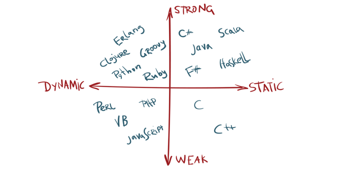

# javascript-notes for Java Developers
This is a repository that contains my notes about javascript, as a Java Developer I omitted many part of the javascript fundamentals for similarities reasons between java and Js. 

To learn more about Javascript from wikipedia, visit the following [link](https://en.wikipedia.org/wiki/JavaScript#Weakly_typed).

## Types
- In Javascript, we don't declare the type of the data, for example we can declare and initialize a number variable like that `var n=1`, later in the program we can also change the type of the variable `n="nowitisastringvariable"`. In java for example we need to declare it as follows: `int n=1`, later in the program we can't change the type of `n`.
- Javascript is a dynamically typed language, to learn more, check the following links: [1](https://stackoverflow.com/questions/1517582/what-is-the-difference-between-statically-typed-and-dynamically-typed-languages), [2](https://android.jlelse.eu/magic-lies-here-statically-typed-vs-dynamically-typed-languages-d151c7f95e2b).

There are two categories of javascript data, the primitive data types and the complex data types. 

## Primitive Values 
- number: One type for decimals and floats, `var n=3.14`.
- string: "str1", 'str2', \`str3\`
- boolean: true or false
- undefined: When we create a variable without assigning a value to it, its value will be undefined, the type also will be undefined.
- null: means an empty value, `var n=null`, the value of n will be null and the  type of n will be object.

## Complex Values 
There are two types in this category, arrays and objects.
- array: `[1,'str1',true]`, arrays are `0` indexed, they can contains heterogenous types, objects type included as follows: `[1,'str1',true, {key1: 1.5}]` .
- object: `{key1:"value1", key2: 1.5, key3: true}`

## NaN
- Returned anytime a method expect a number input, and the caller pass a non number, the following expression will return NaN: `Math.sqrt('Mehdi the special one')`
- `typeof NaN` will return number.
- To check if a given value is of type NaN, we can use the function `isNaN(Math.sqrt('Mehdi the special one)`.


## Comparison Operators
- `45 == 45` will return true, we check if the two are equal.
- `45 === "45"` will return false, we check if both are equal and their type is the same, it is called the strict equal.
- `5 != "5"` will return false, we check if the two numbers are not equal.
- `5 !== "5"` will return true, we check if the two numbers are not equal or they don't have the same type.

## Functions
- function declaration:
    ```
        function functionName(param1, param2){
            //body of the function
            // the possibility to return a value
            //the returned value can be of any type, even a function
        }
    ```

## Strong, Weak, Dynamic ans Static language
- JavaScript is a weakly dynamic language, to read more about that, check the following links: [1](https://android.jlelse.eu/magic-lies-here-statically-typed-vs-dynamically-typed-languages-d151c7f95e2b), [2](https://en.wikipedia.org/wiki/Strong_and_weak_typing), [3](https://www.i-programmer.info/programming/theory/1469-type-systems-demystified-part2-weak-vs-strong.html).



## Type Coercion
### Explicit Coercion: 
- `String(10)` will return a string data type.
- `Number("1")` will return a number data type.
- `Boolean("string")`

### Implicit Coercion: 
- performed by javascript behind the scene, `"5"/2`.

## Scopes
- Global scope, local scope, block scope, function hoising, function scope, nested scopes
- Using the `var` keyword, we can create two variables with the same name.


- As we can see in the above example, the variable `one` is a global variable and can be accessed from anywhere, the `number` variable declared with `let` keyword is local to its function and can not be accessed globally, the variable `three` even with the `var` keyword can not be accessed globally because its scope is the same as the function `innerFunction()` and can only be accessed inside the getApi function. For more details about scopes, visit the following links: [1](https://stackoverflow.com/questions/762011/whats-the-difference-between-using-let-and-var), [2](https://medium.com/@vincent.bocquet/var-let-const-en-js-quelles-diff%C3%A9rences-b0f14caa2049).

- For those reasons, it is recommended to use the `let` or the `const` keywords whenever possible.

## Closures
- A closure gives you access to an outer function's scope from an inner function, for more details check [1](https://developer.mozilla.org/en-US/docs/Web/JavaScript/Closures), [2](https://www.pierre-giraud.com/javascript-apprendre-coder-cours/closure/).


## Articles
- [Semicolon in Js](https://flaviocopes.com/javascript-automatic-semicolon-insertion/).
- Expression Vs Statement: [1](https://stackoverflow.com/questions/12703214/javascript-difference-between-a-statement-and-an-expression#:~:text=%E2%80%9CWherever%20JavaScript%20expects%20a%20statement,the%20argument%20of%20a%20function.%E2%80%9D), [2](https://medium.com/launch-school/javascript-expressions-and-statements-4d32ac9c0e74), [3](https://2ality.com/2012/09/expressions-vs-statements.html).
- Is javascript an interpreted or compiled language: [1](https://medium.com/@almog4130/javascript-is-it-compiled-or-interpreted-9779278468fc), [2](https://blog.sessionstack.com/how-javascript-works-inside-the-v8-engine-5-tips-on-how-to-write-optimized-code-ac089e62b12e), [3](https://stackoverflow.com/questions/9623813/is-javascript-compiled-or-an-interpreted-language).
- Function hoising [1](https://developer.mozilla.org/fr/docs/Glossaire/Hoisting), [2](https://scotch.io/tutorials/understanding-hoisting-in-javascript#:~:text=Hoisting%20is%20a%20JavaScript%20mechanism,scope%20is%20global%20or%20local.), [3](http://adripofjavascript.com/blog/drips/variable-and-function-hoisting.html).


